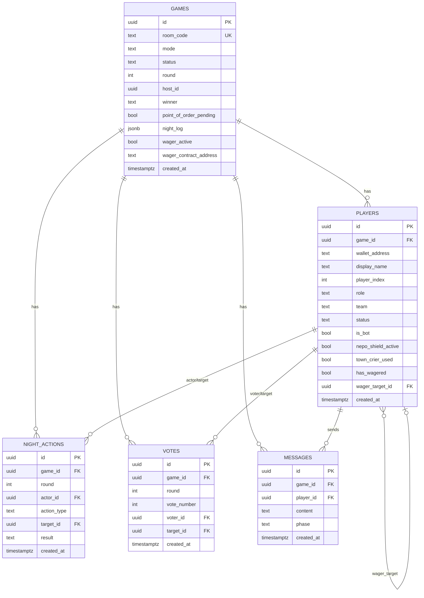
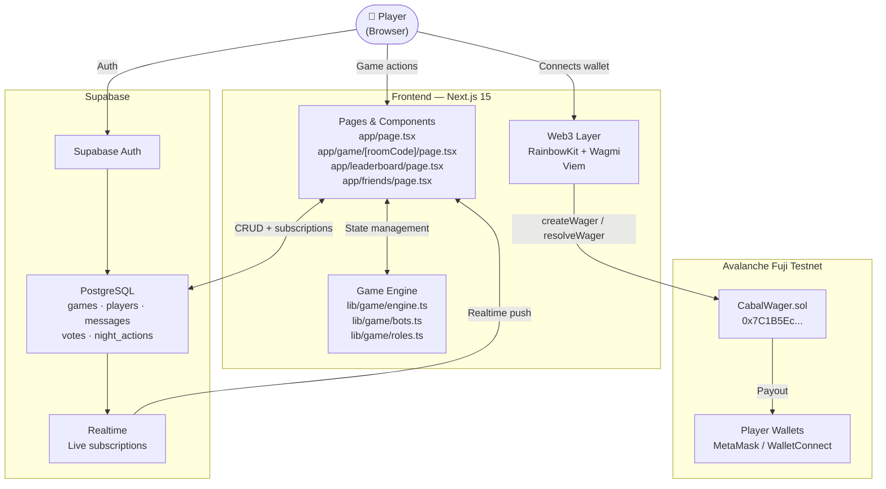

<div align="center">
  
  <br/>
  <h1>Conquest</h1>
  <p><strong>A Nigerian-themed social deduction game with on-chain wagering — built on Next.js, Supabase, and Avalanche.</strong></p>
  <br/>
  
  
  
  
  
</div>

---

## What is Conquest?

Conquest is a social gaming platform that builds real human connections — at live events, virtual hangouts, and across distances. It's flagship game "Cabal" a real-time, multiplayer social deduction game set against the backdrop of Nigerian politics and power. Players are assigned secret roles — some are loyal citizens, others are part of the shadowy **Cabal**. Each night, the Cabal eliminates a citizen. Each day, players debate and vote to exile who they believe is the enemy.

The game features:
- **7 unique roles** with special abilities
- **Supabase Realtime** for live game state sync across all players
- **On-chain wagering** via a Solidity smart contract on Avalanche Fuji
- **Bot mode** for solo testing — play against AI-controlled bots
- **Web3 wallet login** (MetaMask, WalletConnect) via RainbowKit

---

## The Characters

| Role | Image | Team | Ability |
|------|-------|------|---------|
| **The Godfather** |  | Cabal | Leads the Cabal. Picks a citizen to eliminate each night. Always appears innocent to the Dibia. |
| **Agbero** |  | Cabal | The Godfather's enforcer. Wakes with the Godfather and carries out the night's work. |
| **The Dibia** |  | Citizen | Investigates one player each night, learning if they are Cabal or Citizen. Cannot expose the Godfather. |
| **The Soldier** |  | Citizen | Protects one player per night. If the Cabal targets that player, the elimination is blocked. |
| **Whistleblower** |  | Citizen | If eliminated — day or night — takes one player down with them. |
| **Nepo Baby** |  | Citizen | Survives the first elimination attempt; a Cabal member's name leaks to all players. |
| **Citizen** |  | Citizen | No special powers. Observe, debate, vote. Find the Cabal. |

---

## Game Flow

```
┌─────────────────────────────────────────────────────────┐
│                        LOBBY                            │
│  Players join via room code · Roles assigned secretly   │
└───────────────────────┬─────────────────────────────────┘
                        │
                        ▼
┌─────────────────────────────────────────────────────────┐
│                   NIGHT PHASE                           │
│  Godfather + Agbero pick a target to eliminate          │
│  Dibia investigates a player                            │
│  Soldier protects a player                              │
└───────────────────────┬─────────────────────────────────┘
                        │
                        ▼
┌─────────────────────────────────────────────────────────┐
│                 NIGHT RESULT                            │
│  Narrator announces who was arrested (or nobody)        │
│  Nepo Baby / Soldier shields resolve here               │
└───────────────────────┬─────────────────────────────────┘
                        │
                        ▼
┌─────────────────────────────────────────────────────────┐
│               DAY DELIBERATION (60s)                    │
│  All players debate in live chat                        │
│  Bots send accusation / deflection messages             │
│  Human clicks "Ready to Vote" when done                 │
└───────────────────────┬─────────────────────────────────┘
                        │
                        ▼
┌─────────────────────────────────────────────────────────┐
│                  VOTING PHASE (30s)                     │
│  Each player votes to exile one person                  │
│  Most votes = exiled (role revealed to all)             │
│  Town Crier can trigger a second vote (Point of Order)  │
└───────────────────────┬─────────────────────────────────┘
                        │
              ┌─────────┴──────────┐
              ▼                    ▼
       Citizens win           Cabal wins
    (All Cabal exiled)    (Cabal ≥ Citizens)
```

**Win Conditions**

| Result | Condition |
|--------|-----------|
| 🟢 Citizens Win | All Cabal members are exiled by vote |
| 🔴 Cabal Wins | Cabal members equal or outnumber living Citizens |
| 💰 Wager Resolved | Smart contract pays out correct predictors |

---

## Tech Stack

| Layer | Technology |
|-------|-----------|
| **Framework** | Next.js 15 (App Router, TypeScript) |
| **Styling** | Tailwind CSS v4 + custom Fraunces / IBM Plex Mono fonts |
| **Realtime DB** | Supabase (PostgreSQL + Realtime subscriptions) |
| **Auth** | Supabase Auth + Web3 wallet via RainbowKit |
| **Blockchain** | Avalanche C-Chain (Fuji Testnet) |
| **Smart Contract** | Solidity 0.8.20 — `CabalWager.sol` |
| **Web3 Hooks** | Wagmi v2 + Viem |
| **Sounds** | HTML5 Audio (custom audio engine) |
| **Hosting** | Vercel (recommended) |

---

## Local Setup

### Prerequisites

- Node.js 18+
- A [Supabase](https://supabase.com) project
- A [WalletConnect](https://cloud.walletconnect.com) project ID
- MetaMask or any EIP-1193 wallet

### 1. Clone & Install

```bash
git clone https://github.com/Yelobyte/Conquest.git
cd Conquest
npm install
```

### 2. Configure Environment

Create a `.env.local` file in the project root:

```env
# Supabase
NEXT_PUBLIC_SUPABASE_URL=https://your-project.supabase.co
NEXT_PUBLIC_SUPABASE_ANON_KEY=your-anon-key

# WalletConnect (RainbowKit)
NEXT_PUBLIC_WALLETCONNECT_PROJECT_ID=your-walletconnect-project-id

# Smart Contract (Avalanche Fuji)
NEXT_PUBLIC_CABAL_WAGER_ADDRESS=0x7C1B5Ec310f28883B97c16dc822178B67285fbD6
NEXT_PUBLIC_CHAIN_ID=43113
```

### 3. Set Up the Database

Run the Supabase migration to create all tables and enable Realtime:

```bash
# Using Supabase CLI
supabase db push

# Or paste the contents of supabase/migrations/001_initial.sql
# directly into the Supabase SQL Editor
```

### 4. Run the Dev Server

```bash
npm run dev
```

Open [http://localhost:3000](http://localhost:3000) in your browser.

> **Bot Mode**: On the main screen, select **Test Mode** to play solo against three AI bots — no wallet or other players needed.

---

## Smart Contract — CabalWager

The `CabalWager` contract lives on **Avalanche Fuji Testnet**.

**Deployed Address:** `0x7C1B5Ec310f28883B97c16dc822178B67285fbD6`

### How Wagering Works

1. Before a game ends, players call `createWager(gameId, targetAddress)` — staking AVAX on who they think is Cabal.
2. Other players can join with `joinWager(gameId, targetAddress)`.
3. When the game resolves, the house calls `resolveWager(gameId, actualCabalAddresses[])`.
4. Correct predictors split the total pot equally. If nobody guessed right, the house retains all funds.

### Contract Interface

```solidity
function createWager(bytes32 gameId, address targetPlayer) external payable;
function joinWager(bytes32 gameId, address targetPlayer)  external payable;
function resolveWager(bytes32 gameId, address[] calldata actualCabalAddresses) external; // house only
function getWagers(bytes32 gameId) external view returns (Wager[] memory);
```

### Deploy Your Own

```bash
# Using Hardhat or Foundry
npx hardhat run scripts/deploy.ts --network fuji
# or
forge create contracts/CabalWager.sol:CabalWager \
  --rpc-url https://api.avax-test.network/ext/bc/C/rpc \
  --private-key $DEPLOYER_KEY
```

---

## Database Schema



---

## Technical Architecture



---

## Project Structure

```
conquest/
├── app/
│   ├── page.tsx                  # Landing / lobby / solo setup
│   ├── game/
│   │   └── [roomCode]/
│   │       └── page.tsx          # Main game engine & UI
│   ├── leaderboard/
│   │   └── page.tsx              # Global leaderboard
│   └── friends/
│       └── page.tsx              # Friends & social
├── lib/
│   └── game/
│       ├── engine.ts             # Core game logic (resolve night, votes, win check)
│       ├── bots.ts               # AI bot decision-making
│       └── roles.ts              # Role definitions, ROLE_SETS, narrator copy
├── contracts/
│   └── CabalWager.sol            # On-chain wagering smart contract
├── supabase/
│   └── migrations/
│       └── 001_initial.sql       # Schema + Realtime setup
├── assets/                       # Character art & logo
│   ├── Conquest_Logo.jpg
│   ├── GodFather.png
│   ├── Agbero.png
│   ├── Dibia.png
│   ├── Soldier.png
│   ├── Whistleblower.png
│   ├── Nepo-Baby.png
│   └── Citizen.png
├── public/
│   └── Conquest_Logo.jpg         # Static-served logo for Next.js
└── tailwind.config.ts
```

---

## Roles Quick Reference

| Role | Team | Night Action | Special Rule |
|------|------|-------------|-------------|
| The Godfather | Cabal | Eliminate | Always appears innocent to Dibia |
| Agbero | Cabal | Eliminate (with Godfather) | — |
| The Dibia | Citizen | Investigate | Cannot expose Godfather |
| The Soldier | Citizen | Protect | Blocks one elimination per night |
| Whistleblower | Citizen | — | Takes one player down when eliminated |
| Nepo Baby | Citizen | — | Survives first attempt; leaks a Cabal name |
| Town Crier | Citizen | Point of Order | Triggers a second vote (once per game) |
| Citizen | Citizen | — | Vote and debate only |

---

## Contributing

1. Fork the repo and create a branch: `git checkout -b feature/your-feature`
2. Make your changes and run `npm run build` to verify no errors
3. Open a pull request against `main`

---

## Owned by

[Yelobyte Studios](https://yelobyte.studio)

---

<div align="center">
  <br/>
  <sub>Built with Love & Fun by Yelobyte Studios</sub>
</div>
